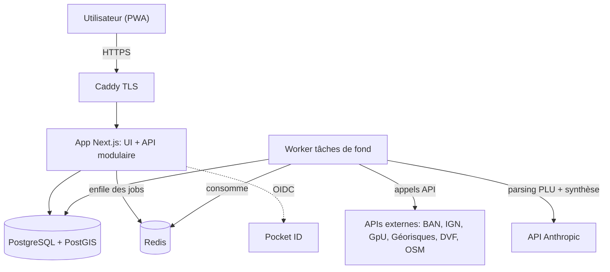

<div align="center">

# Veriterra

**Acheter un terrain en confiance.**
Chaque donnée sourcée, datée et vérifiable. Jamais un chiffre orphelin.

</div>

---

## Le problème

Acheter un terrain à bâtir est une décision à fort enjeu prise avec une information dispersée et opaque. Le cadastre, le PLU, les risques (inondation, argile, radon), les prix du secteur, la pente, l'ensoleillement : tout existe, mais éclaté entre une dizaine de sources publiques, techniques et rarement recoupées. Résultat, on décide au feeling, on découvre les mauvaises surprises trop tard (non constructible, servitude, terrain inondable), et on n'a aucun moyen simple de comparer plusieurs terrains objectivement.

## Le produit

À partir d'une simple adresse, Veriterra localise la parcelle et génère une **synthèse sourcée** du terrain :

- **Localisation** : recherche d'adresse, cadastre sur fond ortho, sélection de la ou des parcelles, surface et identifiants.
- **Synthèse foncière** : cadastre, zonage et règles PLU (emprise, hauteur, reculs), risques, prix du secteur et écart au prix demandé, pente et exposition, services de proximité.
- **Ensoleillement en 3D** : exploration des ombres portées du relief et des bâtiments, sur la journée et sur l'année. C'est la fonctionnalité signature.
- **Suivi et comparaison** : portefeuille de terrains, statuts, notation, tableau comparatif triable, dashboard carte.

Ce qui distingue Veriterra : **la traçabilité**. Toute valeur affichée (prix, emprise, hauteur, risque) porte sa source, sa date et un indice de confiance. L'IA synthétise et explique, elle **n'invente jamais un chiffre**. Et quand une donnée manque (hors couverture, commune au RNU, pas de LiDAR), c'est affiché comme « donnée indisponible », jamais masqué par une valeur par défaut.

## La vision

Aujourd'hui, Veriterra outille **l'acheteur**. Demain, l'ambition est de relier tout l'écosystème du foncier : **acheteurs**, **constructeurs** et **agents immobiliers**. La stratégie est de commencer par la valeur acheteur (des porteurs de projet qualifiés), car c'est cette demande qui donne de la valeur à la mise en relation. Le socle multi-organisation en place dès le premier jour est pensé pour ouvrir cette porte sans refonte.

## Fonctionnalités

| Statut | Périmètre |
|---|---|
| ✅ Livré | Socle : authentification OIDC, multi-tenant strict (Row-Level Security), stack déployable. Design system `@veriterra/ui`. |
| 🚧 En cours | Créer un terrain de bout en bout : adresse, cadastre, fiche persistée, dashboard carte, outils de mesure. |
| 🗺️ À venir | Enrichissement automatique sourcé (PLU par IA, risques, prix DVF, pente, services), scoring et comparaison, soleil interactif 3D, CRM et PWA mobile, exports. |

Le détail par tranche est dans [`PLAN.md`](PLAN.md), les user stories dans [`docs/backlog.md`](docs/backlog.md).

## Architecture

Monolithe modulaire (modules à frontières nettes : `terrains`, `enrichment`, `sun`, `scoring`, `crm`, `admin`, `auth`) accompagné d'un worker de tâches de fond. Simple à déployer, prêt à devenir un SaaS.



**Moteur d'ombres en deux étages** : rendu interactif léger côté client (emprise locale, WebGL) ; analyses lourdes (halo annuel, heatmap) précalculées par le worker et servies comme tuiles déjà cuites. Détails dans [`docs/architecture.md`](docs/architecture.md).

### Stack

Next.js (App Router, TypeScript) · Tailwind CSS v4 + shadcn/ui (design system `@veriterra/ui`) · MapLibre GL JS + deck.gl · Turf.js · SunCalc · PostgreSQL + PostGIS · Prisma · Redis + BullMQ (worker) · Auth.js (OIDC, Pocket ID) · PWA · Docker Compose + Caddy (TLS).

## Décisions clés

**Règles inviolables du produit**

1. **Chiffres sourcés et traçables.** Chaque valeur porte source, date et indice de confiance. Pour le PLU, on cite l'article du règlement d'origine.
2. **Isolation multi-tenant stricte.** Chaque donnée est rattachée à une organisation, imposée à la couche d'accès **et** par le Row-Level Security PostgreSQL, testée explicitement.
3. **Pas de donnée traitée en cas de première classe.** Une source indisponible s'affiche telle quelle, jamais une valeur par défaut silencieuse.
4. **Unités métriques** partout, **textes français** sans tiret cadratin, **secrets hors du dépôt** (clés d'API côté serveur uniquement).

**Choix techniques**

- **Sécurité par la base, pas par le code** : rôle applicatif restreint (non superuser, non BYPASSRLS) + `ENABLE`/`FORCE` RLS et policies par organisation. Un `where` oublié ne fuit rien.
- **Une organisation par utilisateur, invisible dans le front** : créée en silence à la première connexion. Le modèle de partage est prêt, activable plus tard sans migration de données.
- **Enrichissement asynchrone** : l'app enfile des jobs et répond tout de suite ; le worker appelle les sources et l'IA en arrière-plan, avec cache agressif (un règlement PLU parsé une seule fois par document).

**Déploiement**

Image pré-construite par la CI et poussée sur GHCR ; [Arcane](https://github.com/getarcaneapp) détecte le nouveau digest et redéploie ; Caddy assure le TLS. Détails dans [`docs/deploiement.md`](docs/deploiement.md).

## État d'avancement

Le socle et le design system tournent en production. La première tranche produit (créer un terrain de bout en bout) est planifiée et en cours. L'état vivant du projet est dans [`PROGRESS.md`](PROGRESS.md).

## Structure du dépôt

```
app/          Next.js (UI + API modulaire)
worker/       Worker BullMQ (tâches de fond)
packages/
  db/         Prisma, migrations, RLS, tests d'isolation
  ui/         @veriterra/ui, design system (composants + tokens + polices)
  shared/     contrats de queue, env, connexion Redis
docs/         cahier des charges, architecture, backlog, design system, déploiement
```

Guide de contribution pour l'agent (règles, Definition of Done, workflow) : [`CLAUDE.md`](CLAUDE.md).

## Développement local

Prérequis : Docker, Node.js 22, pnpm.

```bash
cp .env.example .env            # renseigner les variables (secrets jamais commités)
docker compose up               # Postgres+PostGIS, Redis, app, worker
pnpm dev                        # dev, app sur http://localhost:3000
pnpm test                       # tests unitaires et d'intégration
pnpm lint && pnpm typecheck
```

## Production

Guide pas à pas : [`docs/deploiement.md`](docs/deploiement.md) (Arcane, image GHCR, `.env`, Caddy, auto-update, durcissement). Déployer la compose **prod** `docker-compose.prod.yml` (image), jamais la compose de dev (`build:`).

## Documentation

- [`CLAUDE.md`](CLAUDE.md) : contrat de fonctionnement (règles, Definition of Done, workflow).
- [`PLAN.md`](PLAN.md) : séquençage des tranches. · [`PROGRESS.md`](PROGRESS.md) : état vivant.
- [`docs/cahier-des-charges.md`](docs/cahier-des-charges.md) · [`docs/architecture.md`](docs/architecture.md) · [`docs/backlog.md`](docs/backlog.md) · [`docs/design-system.md`](docs/design-system.md) · [`docs/risques.md`](docs/risques.md) · [`docs/deploiement.md`](docs/deploiement.md).
