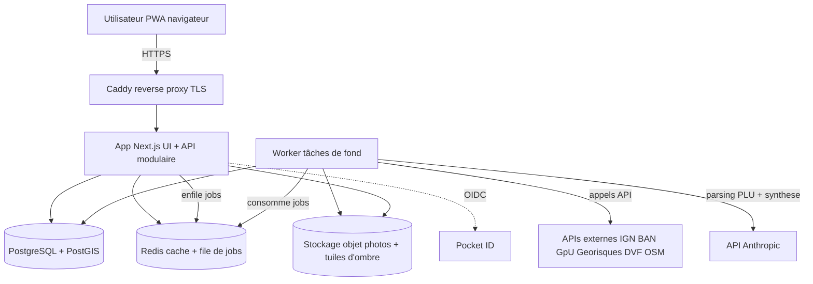
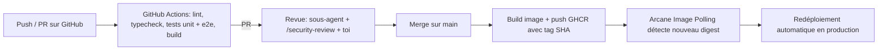

# Architecture — Veriterra

## Choix : monolithe modulaire plus worker

Pour un produit construit en vibe-coding, qui doit rester simple à déployer mais pouvoir devenir un SaaS, le bon compromis est un monolithe modulaire (un seul applicatif, des modules à frontières nettes) accompagné d'un worker de tâches de fond. On évite les microservices à ce stade (complexité d'ops inutile, difficile à vibe-coder). Les modules pourront être éclatés en services plus tard.

Modules internes à frontières nettes : `terrains`, `enrichment`, `sun`, `scoring`, `crm`, `admin`, `auth`. Chaque module expose une interface claire et ne touche pas les tables d'un autre directement.

## Schéma

## Moteur d'ombres en deux étages

C'est la fonctionnalité signature et le vrai morceau d'ingénierie.

- **Interactif léger (côté client).** Vue temps réel (instant, journée animée) sur géométrie légère : maillage de terrain plus bâtiments BD TOPO extrudés, ombres WebGL façon SunMap. Fluide y compris sur mobile. On ne charge que l'emprise locale.
- **Analyse lourde (côté serveur).** Halo annuel aux solstices, heatmap d'ensoleillement, ombres fines avec végétation depuis le MNS : précalculées par le worker et servies comme tuiles d'ombre ou calque déjà cuit. Le client n'affiche qu'un résultat, il ne le calcule pas. Déclenchées à la demande depuis l'onglet "analyse avancée".

Le MNS étant lourd, on ne charge jamais le raster brut dans le navigateur.

## Pipeline d'enrichissement (asynchrone)

À la création d'un terrain, l'app enfile des jobs et répond tout de suite. Le worker appelle en parallèle BAN, API Carto (cadastre, GpU), Géorisques, DVF, RGE ALTI, OSM, puis l'API Anthropic pour le parsing PLU. Chaque résultat est stocké comme bloc daté avec source et confiance. Cache agressif (Redis et table) : le règlement PLU est parsé une fois par document, les réponses parcellaires mises en cache 30 jours. Cela sert la contrainte de faible consommation de données.

## Multi-tenant

Chaque table porte un `organisation_id`. Isolation imposée à la couche d'accès et via le Row-Level Security PostgreSQL (politique par organisation), pour qu'aucune requête ne franchisse la frontière. Test d'isolation obligatoire.

## CI/CD

Points clés : image pré-construite poussée sur GHCR (Arcane ignore les images construites localement). Service labellisé `com.getarcaneapp.arcane.updater=true`, Image Polling et Auto Update activés. Migrations réversibles, images taguées par SHA pour rollback manuel, sauvegarde de la base avant déploiement, volumes Docker nommés.

## Déploiement

- Façade Caddy avec TLS automatique.
- Sous-domaines : `foncier.tondomaine.fr` (app), `admin.foncier.tondomaine.fr` (admin). Le jour du SaaS, bascule sur un domaine dédié via variable d'environnement.
- Stack en docker compose : app, worker, postgres, redis, stockage objet (volume ou MinIO), gérée par Arcane.
- Secrets via variables d'environnement, jamais dans le dépôt.
